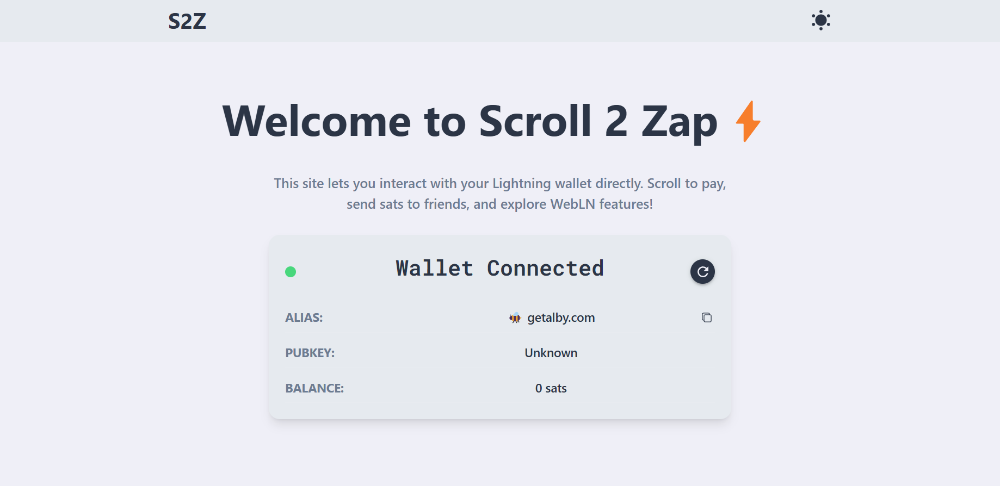
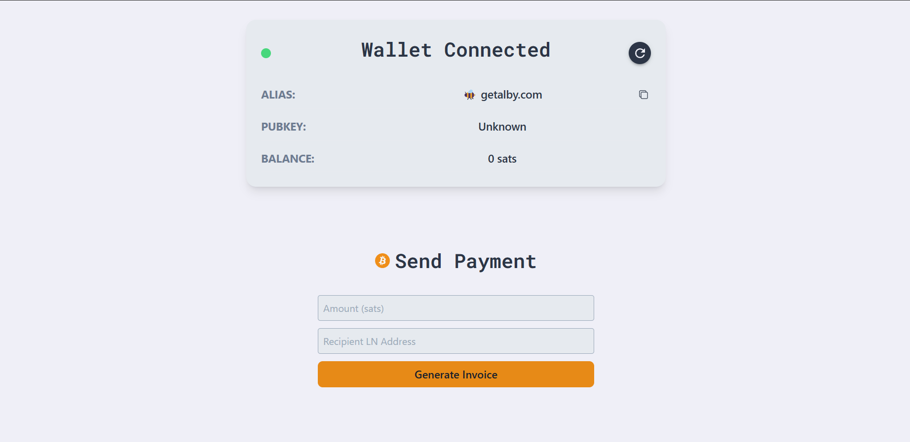
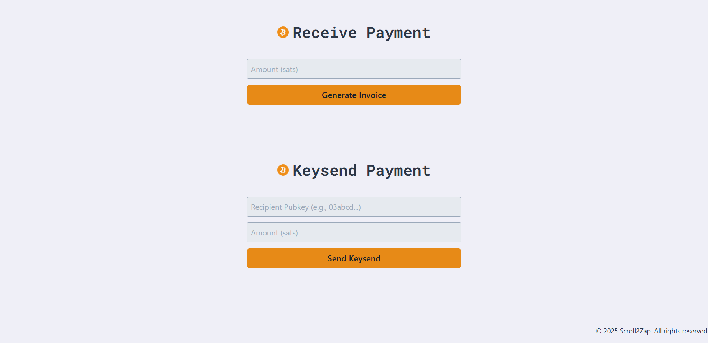
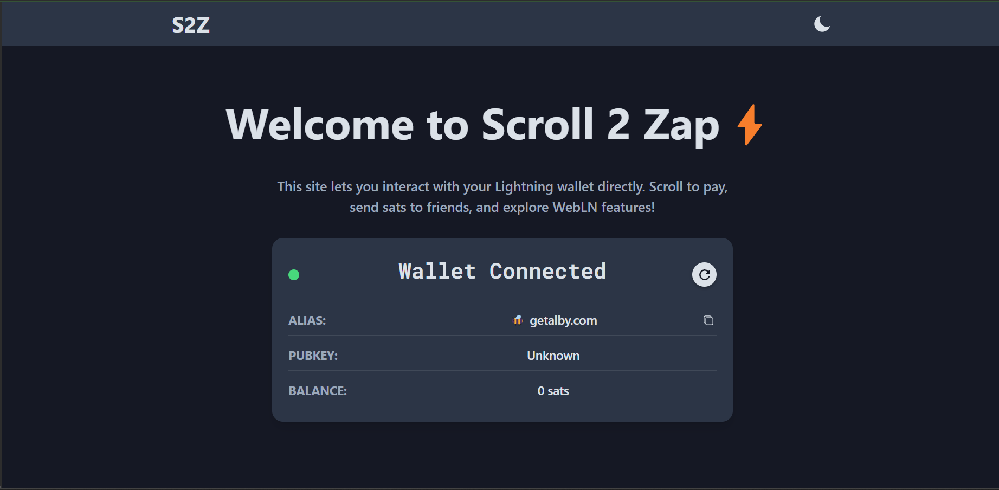
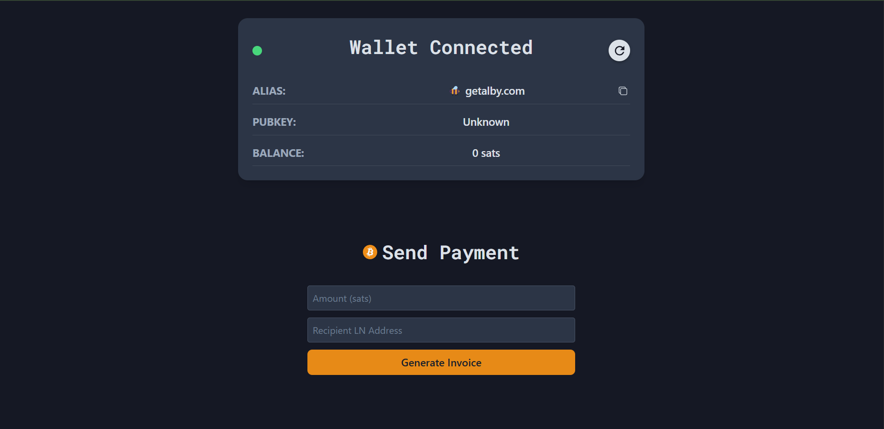
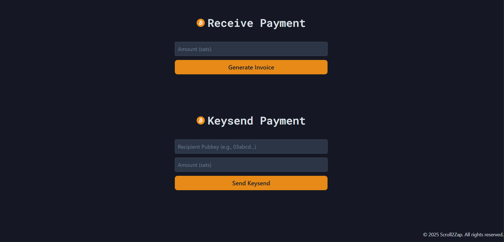

# Scroll2Zap⚡: Lightning Web Application

## Demo Images

<div style="display: flex; flex-direction: column; justify-content: center; gap: 10px;">
  <div>
    
  </div>
  <div style="display: flex; flex-direction: row; justify-content: space-between;">
    
    
  </div>
</div>


<div style="display: flex; flex-direction: row; justify-content: center; gap: 10px; margin-top: 20px;">
  
  <div style="display: flex; flex-direction: column; justify-content: space-between;">
    
    
  </div>
</div>


## Project Description

Scroll2Zap is a modern and minimal Lightning Web Application, designed to deliver smooth WebLN interactions in real-time. This application allows users to send Lightning payments and interact with WebLN in an intuitive way. Also Scrolling on the Websites transfers 1 sats to me! 😊

## Features

* **getInfo:** Fetch and display information about the user's Lightning wallet.
* **sendPayment:** Send payments using WebLN.
* **keysend:** Send keysend payments to a recipient.
* **Auto-payment on Scroll:** Trigger a WebLN payment (1 sat) whenever the user scrolls on the website.
* **makeInvoice:** Generate and display a Lightning invoice for a given amount.
* **Pay via WebLN:** Accept an amount and LN address, then process the payment using WebLN's `sendPayment`.
* **Dark Mode:** Supports both light and dark themes.
* **QR Code Scanner:** Scan LN invoices and pay via WebLN.

## Technical Details

* **Frontend:** React (with Vite)
* **State Management:** React Hooks (`useState`, `useEffect`)
* **Styling:** Tailwind CSS
* **Lightning Integration:**
    * WebLN API
    * Alby browser extension
    * Alby Packages:
        * `@getalby/bitcoin-connect`: WebLN provider initialization.
        * `@getalby/js-sdk`: Payment subscriptions, invoice generation, keysend.
        * `@getalby/lightning-tools`: LN address resolution, keysend utilities.
* **UI Libraries:**
    * `@mui/icons-material`
    * `@theme-toggles/react`
* **QR Code:** `qrcode.react`
* **Tooling:**
    * Vite
    * ESLint
    * Prettier
    * PostCSS
    * Autoprefixer

## Installation

1.  Clone the repository:
    ```bash
    git clone <repository_url>
    ```
2.  Navigate to the project directory:
    ```bash
    cd scroll2zap
    ```
3.  Install dependencies:
    ```bash
    npm install
    ```
4.  Run the application:
    ```bash
    npm run dev
    ```

## Usage

1.  Ensure you have a WebLN-enabled browser extension (like Alby) installed and configured.
2.  Open the Scroll2Zap application in your browser.
3.  Interact with the various features:
    * Use the buttons to fetch wallet info, send payments, and generate invoices.
    * Try the "Auto-payment on Scroll" feature by scrolling the page.
    * Use the QR code scanner to scan and pay invoices.
    * Toggle between light and dark mode using the theme toggle.

## Code Structure

The project follows a modular component architecture:

* Components are separated based on functionality (e.g., payment, UI elements).
* Logic, UI components, and assets are organized for maintainability.
* React functional components with hooks are used.

## Design

* The application uses a modern and minimal design.
* Tailwind CSS is used for utility-first styling, allowing for easy customization.
* Theming is implemented with dark mode support.
* Typography and responsiveness adhere to project design guidelines.

## Documentation

* For more in-depth information about the project's development process, please refer to the [Notion documentation](https://www.notion.so/Scroll2Zap-1d2396e6a0c880c684daf6ea45ea5101?pvs=4).

## Author

* Shresth Deorari
    * GitHub: [Shresth-Deorari]([https://github.com/your-username](https://github.com/Shresth-Deorari))
    * LinkedIn: [shresth-deorari-iit-patna](https://www.linkedin.com/in/shresth-deorari/)
    * Email: shresthdeorari38@gmail.com

## Acknowledgments

* Thank you to the Alby team for their resources and support.
